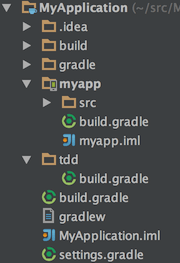

gradle-robojava-plugin
======================

Robojava is a [Gradle](https://www.gradle.org) plugin that allows simple integration of [Robolectric](http://robolectric.org/) into Android Studio. This plugin works by creating a stub java project. This allows extending it with powerful plugins that are compatible with gradle java projects, but not with gradle android projects, like [Gradle Cobertura Plugin](https://github.com/stevesaliman/gradle-cobertura-plugin) for example.

Usage
-----
The plugin is available on [Jcenter](https://bintray.com/bintray/jcenter)

Assuming your project structure is a [Multi Project Gradle Build](https://gradle.org/docs/current/userguide/multi_project_builds.html), add the following to your root `build.gradle`:

```groovy
buildscript {
    repositories {
        jcenter()
    }
    dependencies {
        classpath "com.kageiit:robojava-plugin:1.1.2"
    }
}
```

Then create a stub project at the same level as your app/lib android project with a `build.gradle` like so:

```groovy
evaluationDependsOn(':myapp')
ext.androidProject = 'myapp' // name of the android project
ext.variant = 'freeDebug' // add the test variant flavor (remove if you do not have use flavors). See example project.
apply plugin: 'cobertura' // add if you want code coverage. See example project.
apply plugin: 'com.kageiit.robojava'
```

The `settings.gradle` in the project root:
```groovy
include 'myapp', 'tdd'
```

You may need to also use a custom test runner (may not be required for library projects). Add the `generated-sources` directory as source directory for the `androidTest` source set:
```groovy
sourceSets.androidTest.java.srcDirs += 'build/generated-sources'
```
This will allow you to configure your custom test runner easily, as the plugin generates code for obtaining the directory paths to the manifest, resources, assets etc. See the included example.

The final structure may look something like this:



This plugin was created mainly to address the problem of not being able to configure Android project tests easily for the IDE and TDD etc. You can now simply do the following:
- Run/debug all robolectric tests in the IDE without any other manual intervention/configuration.
- Run a set of tests via the commandline: `./gradlew test --tests com.exampe.MyActivityTest.testAwesomeMethod`
- NO modifications required to Android Studio. Configuration lives with the project.

Compatibility
-------------

This plugin was tested against
- Android Studio - v1.0.1
- Android Gradle Build Plugin - v1.0.0

Known Issues
------------
- Only one test variant can be chosen at a time to run, if you are running single tests via the commandline. This limitation will be removed in a future release. Although, you can run all tests of all variants/flavors by simply running `./gradlew test'.
- All tests in the main source set are fully integrated into Android Studio, but product flavor integration is currently in progress. You can run them via the commandline, however.

License
-------

    Copyright 2014 Gautam Korlam

    Licensed under the Apache License, Version 2.0 (the "License");
    you may not use this file except in compliance with the License.
    You may obtain a copy of the License at

       http://www.apache.org/licenses/LICENSE-2.0

    Unless required by applicable law or agreed to in writing, software
    distributed under the License is distributed on an "AS IS" BASIS,
    WITHOUT WARRANTIES OR CONDITIONS OF ANY KIND, either express or implied.
    See the License for the specific language governing permissions and
    limitations under the License.
